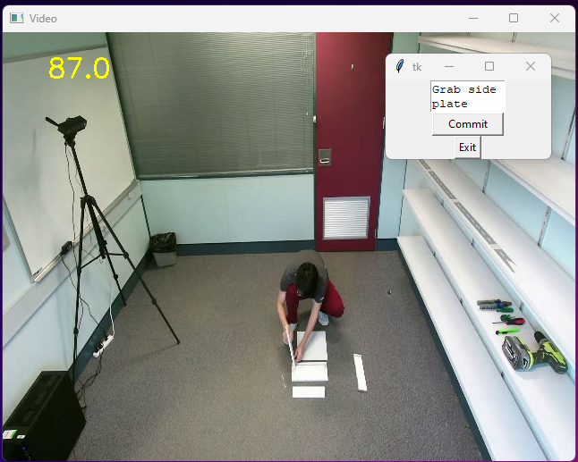

# RAVEE

The RAVEE project provides a general approach to extract process-mining-conform event logs from unstructured video data in an unsupervised manner.
It targets custom datasets and is an implementation of the RAVEE reference architecture. In [Supplementary_Material_SLR](Supplementary_Material_SLR.pdf) you can see how the RAVEE differs from other works at the intersection of video data and process mining. In [Supplementary_Material_EVAL2_and_4](Supplementary_Material_EVAL2_and_4.pdf) you can find experts' opinions on the design and the results of RAVEE.

## Dependencies

The RAVEE project uses several open source computer vision projects.

- [TW-FINCH](https://github.com/ssarfraz/FINCH-Clustering/tree/master/TW-FINCH) ([License](https://github.com/ssarfraz/FINCH-Clustering/blob/master/LICENSE.txt)): For activity segmentation
- [Dense improved trajectories](https://github.com/chuckcho/iDT/tree/master) ([License](https://github.com/chuckcho/iDT/blob/master/README.md)): For feature trajectory extraction
- [PM4Py](https://github.com/pm4py/pm4py-core) ([License](https://github.com/pm4py/pm4py-core/blob/release/LICENSE)): For XES event log generation
- [IKEA Dataset](https://ikeaasm.github.io/) ([License](https://ikeaasm.github.io/)): As examplary dataset for proof of concept

## License

The RAVEE project is released under the [GNU General Public License v3.0](LICENSE).

## Functionality

The RAVEE project comprises a GUI that automates and facilitates several tasks:
- Preprocessing of custom video datasets for activity segmentation
- Segmentation of video files in activity steps at previously defined granularity
- Labeling of activity steps to derive an event log
- Extraction of process-mining-conform event logs from unstructured video data

## Installation

Please find installation instructions in [Intall.md](Install.md).

## Use RAVEE For Training Or Testing Models

After preparing your dataset, you can run it in the demo mode, which is activated as default mode. In demo mode the RAVEE prototype uses the supplementary material provided in "DemoFiles" to run on an examplary video. In a first step you can determine the granularity level in which you want to investigate the video from four different levels provided by the prototype. Then you can label the different activity steps detected by the algorithm and extract an event log from the information obtained.

If you want to run the RAVEE prototype on your own video files, you just have to turn-off the demo mode by setting the 'DEMO'-Parameter in the main.py file (provided in the toolbox folder) to 'False'. Afterwards you can create a folder called 'video_input' within your folder strucutre to store the video(s) to be investigated. When running the project docker needs to be running aswell to compute the IDT in a first step. Afterwards you can again choose the granularity level, inspect & label the activity segments just obtained and extract an event log. If you want to extract a certain number of activity steps (i.e., set a certain level of granularity), you have to set the 'required_cluster' parameter in the main.py file from 'None' to the desired number.

## Instantiation of RAVEE components

You can find out which components of the RAVEE were instantiated in our software prototype in [Supplementary_Material.md](Supplementary_Material.md).
