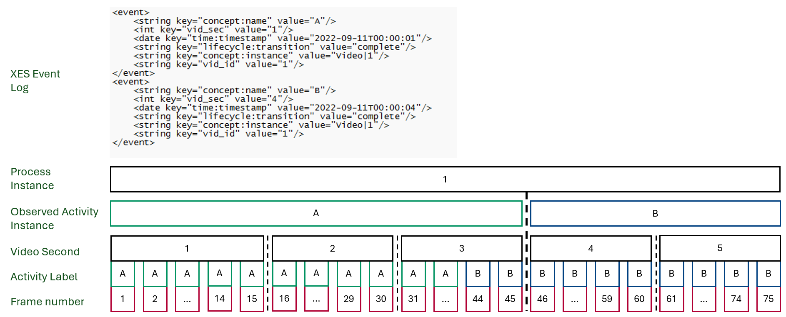

# Description of the RAVEE instantiation
This section provides a detailed description on how we instantiated the prototype's components.

## Component: Video Data
Video Data: As video input for our prototype, any video format supported by OpenCV's VideoCapture can be processed. This allows for the handling of a wide variety of publicly available labeled datasets in our instantiation (e.g., [Breakfast](https://serre-lab.clps.brown.edu/resource/breakfast-actions-dataset/), [ToyAssembly](https://assembly-101.github.io/), [IKEA](https://ikeaasm.github.io/)). Furthermore, non-public datasets can also be processed with our prototype as long as they conform to common video file formats.

## Component: Data Processor subsystem
Data Processor subsystem: As previously discussed, the input in the form of a video file is processed in the Video2Frame Converter component of the Data Preprocessor.

### Component: Video2Frame Converter
Video2Frame Converter: For the preprocessing step, as already mentioned, OpenCV's VideoCapture is used to transform the video file into individual frames. To reduce the overall amount of data, the videos are reduced to 15 FPS, as this has proven to produce good results for similar approaches [Kuehne et al., 2014](https://paperswithcode.com/paper/the-language-of-actions-recovering-the-syntax). The resolution of the individual frames is adjusted to 640x480 pixels, as this resulted in the best outcomes for our test runs.

### Component: Feature Extractor subsystem
Feature Extractor subsystem: To obtain the frame representations required in our instantiation variant, we employ all optional (sub)components of the Feature Extractor subsystem, with the exception of the Investigation Area Segmenter subcomponent.

### Component: Video2Grey Converter
Video2Grey Converter: As the instantiations of the following components perform better on grayscaled frames, we use the Video2Grey Converter component in our implementation to receive a frame batch in grayscale.

### Component: Feature Generator
Feature Generator: As we refrain from using the Investigation Area Segmenter subcomponent in our implementation, our feature generator consists of four subcomponents that create a feature set suitable for further processing. During the computation of this framewise feature set, dimensionality reduction to 64 dimensions is performed at three stages: following the use of the Trajectory Extractor, the Descriptor Generator, and the Feature Representation Generator components. In the following, we will go into more detail about the concrete realization of the individual subcomponents.

### Component: Trajectory Extractor
Trajectory Extractor: In the first step of feature generation, improved versions of the Dense Trajectory Features are computed [Wang et al., 2013](https://dl.acm.org/doi/abs/10.1109/ICCV.2013.441). These trajectories have gained popularity due to their strong performance as motion-based descriptors. We use the default parameters (i.e., trajectory length of 15, local neighborhood of the trajectory of 32x32 pixels, etc.) according to Wang et al. to extract the improved Dense Trajectory Features.

### Component: Descriptor Generator
Descriptor Generator: During the step of calculating the improved Dense Trajectory Features, the feature descriptors histogram of oriented gradients (HOG), histogram of optical flow (HOF) and motion boundary histogram (MBH) are generated for the computed trajectories as described in [Wang et al., 2013](https://dl.acm.org/doi/abs/10.1109/ICCV.2013.441). Through the trajectory descriptors a concentration of normalized displacement vectors is obtained.

### Component: Feature Representation Generator
Feature Representation Generator: The objective of the Feature Representation Generator is to generate an adequate feature representation for each frame of the video input.
Our prototype uses the Fisher Vector for this purpose. In order to calculate the Fisher Vector, a random sample of 200.000 features is obtained in a preliminary step, based on the population of all features. This sample is then used to fit the Gaussian Mixture Models, which were implemented as an instance of the Gaussian Mixture of scikit-learn [Buitinck et al., 2013](https://www.researchgate.net/publication/256326897_API_design_for_machine_learning_software_Experiences_from_the_scikit-learn_project). For the number of Gaussians k in{ 1,...,K} representing the individual clusters k of the gaussian mixture, K=64 was chosen, based on the evaluation of different amounts of Gaussians in [Kuehne et al., 2014](https://paperswithcode.com/paper/the-language-of-actions-recovering-the-syntax). Based on its associated descriptors, a Fisher Vector can then be calculated for each frame using these descriptors and the Gaussian Mixture Model.

### Component: Dimensionality Reducer
Dimensionality Reducer: As already outlined, it is advantageous, or sometimes even necessary during feature computation, to adjust the dimensionality of the individual vectors.
For this matter, we used the PCA across the entire prototype, which we also implemented as an instance of scikit-learn [Buitinck et al., 2013](https://www.researchgate.net/publication/256326897_API_design_for_machine_learning_software_Experiences_from_the_scikit-learn_project). Using this component, we first reduced the dimensionality of the concatenated descriptors from 426 dimensions to 64 dimensions, following [Oneata et al., 2013](https://ieeexplore.ieee.org/document/6751336). This speeds up computation of the Fisher Vector and decorrelates data, which in turn improves the calculations using the Gaussian Mixture Model.
Second we ensure that each frame is represented by a 64 dimensional set of descriptors. Finally, the dimensionality of the Fisher Vector per frame is reduced to 64 dimensions, so that each frame is represented by a 64 dimensional Fisher Vector.

## Component: Information Extractor Subsystem
Information Extractor Subsystem: The goal of the Information Extractor subsystem is to use the previously obtained features to subdivide the video input into individual process steps. 
As previously discussed, we only implemented the loop highlighted in blue from the RAVEE for our prototype. In the course of the information extraction process, input from a process/domain expert is required at some points of our prototypical implementation.

### Component: Action Segmenter
Action Segmenter: To identify individual process steps based on the previously obtained feature set, we implement the TW-FINCH algorithm of [Sarfraz et al., 2021](https://www.researchgate.net/publication/350311386_Temporally-Weighted_Hierarchical_Clustering_for_Unsupervised_Action_Segmentation). The algorithm requires as input the previously calculated feature set, as well as an optional parameter with the number of clusters to be generated.
From this, the algorithm generates a plausible video segmentation in an iterative procedure. This is accomplished by linking frames based on their feature space proximity and their respective position in time.
As output, a hierarchy of partitions is generated, where each partition contains fewer clusters than the previous one. Here, the respective frames of the video are assigned to the individual clusters. Depending on the number of clusters, the video can be examined at a higher or lower level of granularity. If the number of clusters to be generated was set as input via the optional parameter, exactly this number of clusters is selected for the output, otherwise the clusters are created on the basis of the cluster averages of their features and timestamps.

### Component: Label Generator
Label Generator: In our prototype, the Label Generator is implemented in a way that assigns to each frame of every cluster the activity label corresponding to the cluster. The context-enriched input for the activity labels is provided by the process/domain expert. Hence, a fully labeled dataset is obtained.

## Component: Event Processor subsystem
Event Processor subsystem: This subsystem compiles the activities that are currently still available on a frame basis into individual process steps in order to generate an event log.
The individual process steps must then be assigned to their respective process instances and also be provided with a timestamp.
Finally, the subsystem exports an event log that can be further examined using process mining applications such as ProM, or Disco.

### Component: Event Aggregator
Event Aggregator: The following figure shows the event abstraction logic of our prototype. The event aggregator is given an activity label as input for every frame. In a further step, the individual frames of the video are grouped into seconds by always allocating the next 15 frames to a second, starting at frame 1. With the information thus obtained, activity instances can be identified. Since activities in our prototype follow each other sequentially, an activity begins in the second in which the majority of associated frames are labeled with said activity.
If different activities occur within the frames assigned to a second, the second is assigned to the activity for which the most frames exist within the second (see Figure, frames 44 and 45 are the only ones in second three labeled with activity B, accordingly second three is still assigned to activity A).
Due to the sequential arrangement of the individual activities, an activity is completed the second before the main portion of the associated frames correspond to another activity. The activity instances obtained this way can now be assigned to a process instance, insofar as process instances can be traced through the structure of the video input.

### Component: Event Log Exporter
Event Log Exporter: Using the [PM4Py Python module](https://pm4py.fit.fraunhofer.de/docs), we exported the data in the form of an XES event log. The structure of the event log generated by our prototype is as follows: A case identifier corresponding to the respective process instance is followed by the activity label of the respective process step. Finally, the timestamp of the starting time of the respective activity follows.
